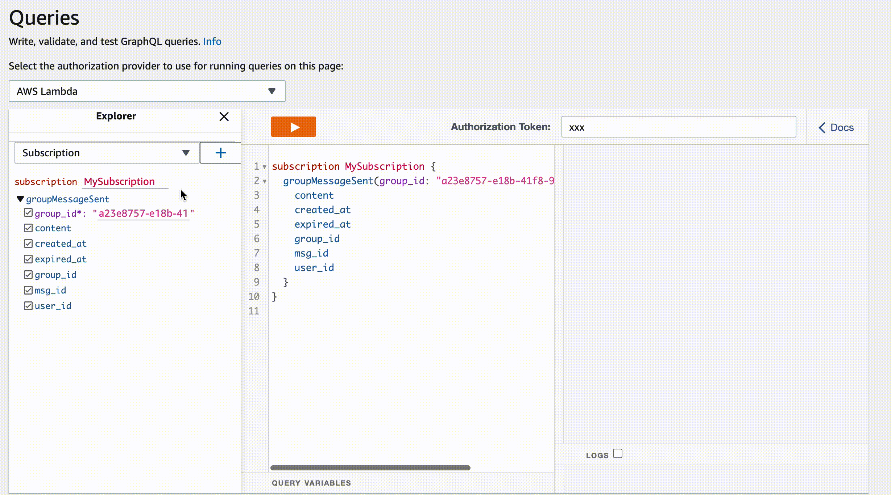

# Simple GraphQL Chat App

We use aws appsync service for our chat app, we can use Aws Cloudformation for deployment. You can activate the application by running the command below. We store our messages on dynamodb. Messages are removed when they expire. You can edit line 303 in cloudformation.yaml (MessageSendFunction) to change this. Then you can use our chat app by connecting to the appsync api url with any graphQL client.

```
aws cloudformation deploy --template-file ./cloudformation.yml --stack-name SimpleChatApp --capabilities CAPABILITY_NAMED_IAM
```

> We need a lambda function for authentication user. The userId returned from the function here will be the userId that we will use in graphql queries. (AWS_LAMBDA)

> Docs: [https://aws.amazon.com/blogs/mobile/appsync-lambda-auth/](https://aws.amazon.com/blogs/mobile/appsync-lambda-auth/)


## Features
- Aws AppSync
- GraphQL
- Serverless
- Dynamodb Expired Messages

## Demo 

### Write
```
mutation MyMutation {
  groupMessageSend(content: "test message") {
    msg_id
  }
}

```

### Read
```
subscription MySubscription {
  groupMessageSent(group_id: "a23e8757-e18b-41f8-9012-43e680a0307d") {
    msg_id
    user_id
    group_id
    content
    created_at
    expired_at
  }
}
```

